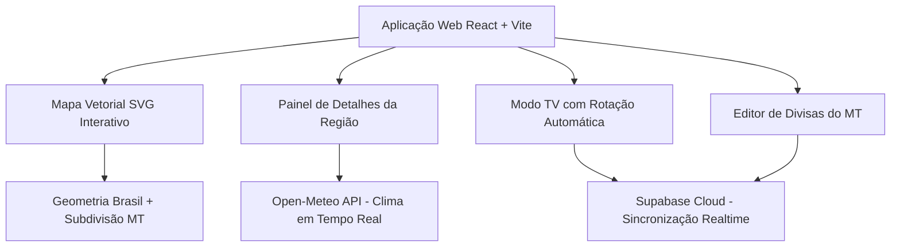

# 🗺️ Mapa Comercial Interativo - ControlSoft
> **Cofre de Documentação Técnica e Operacional**  
> *Versão:* 1.0.0 • *Atualizado:* Agosto de 2026 • *Empresa:* ControlSoft

---

## 📌 Visão Geral do Projeto

O **Mapa Comercial Interativo** é uma aplicação web moderna de alta performance, desenvolvida para fornecer visualização em tempo real da cobertura geográfica, equipes de atendimento, municípios atendidos e condições meteorológicas da **ControlSoft** no agronegócio brasileiro.

A plataforma foi projetada para operar tanto em **Modo Estação de Trabalho** (interação via mouse/toque para consultores e gestores) quanto em **Modo TV Corporativa** (painel dinâmico de exibição contínua com alternância automática entre regiões comerciais e persistência em nuvem via Supabase).

---

## 🧭 Mapa de Conteúdo (MOC)

Navegue pelas notas técnicas e operacionais deste cofre:

| # | Nota | Descrição |
|---|------|-----------|
| 01 | [[01 - Linha do Tempo e Histórico do Projeto]] | A jornada do projeto desde os requisitos iniciais, planilha Excel, até a versão fullstack atual. |
| 02 | [[02 - Arquitetura de Software e Tecnologias]] | Stack tecnológica (React, TS, Tailwind, Vite, Supabase, Open-Meteo), estrutura de pastas e design patterns. |
| 03 | [[03 - Geometria Vetorial e Divisas do MT]] | Construção do mapa em SVG puro, algoritmos de subdivisão regional, nós vetoriais e ancoragem matemática. |
| 04 | [[04 - Modelagem de Dados e Cidades]] | Estrutura das 4 regiões, 100 municípios mapeados, coordenadas geográficas e atribuições de equipe. |
| 05 | [[05 - Módulo Meteorológico (Open-Meteo API)]] | Integração com dados de tempo/temperatura/chuva, batch requests, cache em memória e WMO weather codes. |
| 06 | [[06 - Modo TV e Sincronização em Nuvem (Supabase)]] | Rotação automática de cards, Realtime broadcast, persistência na nuvem e redundância local. |
| 07 | [[07 - Guia do Usuário e Operação do Painel]] | Manual de uso do painel, filtros por estado/cidade, ajuste de tempos de TV e editor de divisas. |
| 08 | [[08 - Guia do Desenvolvedor, Setup e Deploy]] | Guia de instalação, scripts npm, variáveis de ambiente, schema SQL do Supabase e deploy em produção. |

---

## 🎯 Pilares e Requisitos Fundamentais

1. **Vetorização 100% Nativa em SVG:** Sem imagens rasterizadas, sem hacks de mapa de bits. Cada estado e divisa é um path SVG vetorial escalável e estilizável via CSS.
2. **Hierarquia Espacial e Sorriso no Polo Central:** Sorriso e Região é tratada espacialmente dentro do Mato Grosso como Polo Central, possuindo consultor, comercial e carteira de cidades dedicada.
3. **Sincronização em Tempo Real na Nuvem:** Todas as configurações de divisas e temporizadores de TV são sincronizados instantaneamente entre múltiplos navegadores e TVs através do Supabase Realtime.
4. **Resiliência e Zero Downtime:** Funcionamento ininterrupto mesmo com falhas de conexão externa, com caches locais e mecanismos de retry automático.
5. **Design Escuro e Responsivo (Ultra Clean):** Interface otimizada para televisores corporativos de grande porte e telas de alta definição sem necessidade de rolagem vertical (scroll-free).

---

*Tags:* #mapa-comercial #controlsoft #documentacao #obsidian #arquitetura #react #supabase
