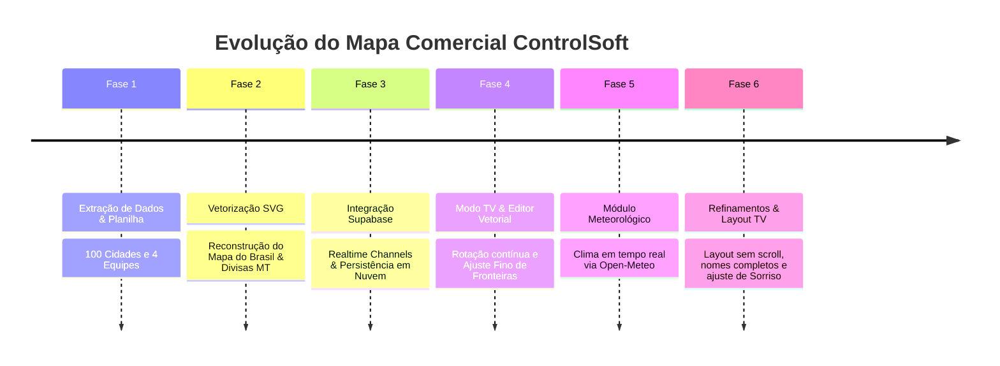

# ⏳ 01 - Linha do Tempo e Histórico do Projeto
> Histórico completo das fases de concepção, desafios técnicos, decisões de arquitetura e evolução até o estado de produção.

---

## 📅 Linha do Tempo das Fases

---

## 🔍 Detalhamento das Etapas de Desenvolvimento

### Fase 1: Análise de Requisitos e Consolidação de Dados
- **Contexto Inicial:** O cliente possuía uma planilha Excel com as cidades atendidas pela ControlSoft, com colunas para Região (Norte, Leste, Oeste, Sorriso), Consultor, Comercial e Atendentes.
- **Desafio:** Cidades com grafias diferentes, municípios recém-emancipados (ex.: *Boa Esperança do Norte*), cidades limítrofes e ausência de coordenadas geográficas.
- **Solução Implementada:** 
  - Criação de scripts de extração em Node.js (`parse_cidades_excel.cjs` e `update_regions_from_excel.cjs`).
  - Geocodificação e mapeamento de latitude/longitude para os 100 municípios em `src/data/cidadesExcel.ts`.
  - Estruturação dos dados no modelo TypeScript `REGIONS_DATA` em `src/data/regions.ts`.

---

### Fase 2: Construção da Geometria Vetorial SVG Nativa
- **Requisito Crucial:** Não utilizar imagens estáticas como fundo ou `` clicáveis. Todo o mapa precisava ser vetorial, dinâmico e responsivo.
- **O desafio do Mato Grosso:** O estado do Mato Grosso precisava ser subdividido em 4 áreas de atendimento comercial (Norte, Leste, Oeste e o Polo Central de Sorriso) sem sobreposição e sem "rasgar" as fronteiras do estado.
- **Solução:**
  - Extração da malha de polígonos dos estados brasileiros a partir do GeoJSON do IBGE (`br-states.json` e `precomputedStates.json`).
  - Geração das linhas divisórias paramétricas com controle por nós (Splines / Curvas de Bézier).
  - Fixação de um ponto de junção central matemático (`x: 405, y: 410`) garantindo selamento perfeito entre Norte, Oeste e Leste.

---

### Fase 3: Integração com Supabase (Backend as a Service & Realtime)
- **Necessidade:** O painel precisava operar em múltiplas TVs e estações com as mesmas configurações de divisas e tempos de rotação, sem depender de localStorage local em cada aparelho.
- **Implementação:**
  - Configuração do client `@supabase/supabase-js` em `src/services/supabase.ts`.
  - Criação da tabela `mapa_config` (chave-valor em JSONB com RLS público e Realtime ativado no PostgreSQL).
  - Canal de broadcast dedicado com tratamento de reconnect e sincronização instantânea de mudanças em milissegundos.
  - Indicador visual no rodapé informando status da conexão com a nuvem (🟢 *Sincronização Nuvem Ativa*).

---

### Fase 4: Modo TV Corporativa e Editor Interativo de Divisas
- **Modo TV:** 
  - Temporizador configurável por região (`tvIntervals`: Norte, Leste, Oeste, Sorriso e Geral).
  - Janela de configurações com modal intuitivo (`TvSettingsModal.tsx`) para o gestor ajustar os segundos de cada slide.
  - Ativação automática ao iniciar o painel.
- **Editor de Divisas:**
  - Ferramenta interna ativada pelo ícone de tesoura ✂️ na barra de ferramentas.
  - 3 modos de edição direta no canvas SVG: **Mover Pontos**, **Inserir Pontos** e **Excluir Pontos**.
  - Gravação instantânea na nuvem (Supabase) refletindo em todas as TVs em tempo real.

---

### Fase 5: Integração Meteorológica em Tempo Real (Open-Meteo)
- **Motivação:** No agronegócio, o clima é fator essencial para o planejamento comercial e de visitas aos clientes.
- **Implementação:**
  - Criação do serviço `src/services/weatherService.ts` consumindo a API gratuita de alta precisão do *Open-Meteo*.
  - Exibição do clima do polo regional no cabeçalho (temperatura, ícone WMO e probabilidade de chuva).
  - Exibição da temperatura individual ao lado de cada município na lista.
  - Sistema de requisições em lotes (*chunks de 8*) e cache de 15 minutos para evitar gargalos de rede.

---

### Fase 6: Ajustes Finos e Otimização para TV (Versão Atual)
- **Nomes Completos e Padronização:** Ajuste de nomes de municípios (como *Bandeirantes*, *Uruaçu*, *Crixás do Tocantins*, *Santana do Araguaia*, *Campos de Júlio* totalizando exatamente as 100 cidades da carteira).
- **Layout 100% Sem Scroll (Zero-Scroll):** Ajuste de densidade visual, tipografia e tamanhos de cards para garantir que qualquer tela (TV 4K/FullHD ou monitor de trabalho) exiba todo o conteúdo sem rolagem.
- **Consolidação do Layout de Sorriso:** Restauração do formato de card unificado com 2 colunas internas de cidades, mantendo harmonia e equilíbrio estético.

---

*Voltar para o [[00 - Visão Geral do Projeto|Índice Geral]]*
