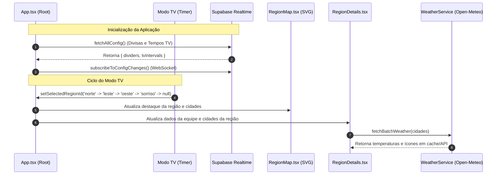

# 🏗️ 02 - Arquitetura de Software e Tecnologias
> Especificação técnica da stack, estrutura de arquivos, padrões arquiteturais e fluxo de dados.

---

## 💻 Stack Tecnológica

| Camada | Tecnologia | Motivação / Uso |
|---|---|---|
| **Linguagem** | **TypeScript 5.x** | Tipagem estática rigorosa para geometrias, dados meteorológicos e contratos de API. |
| **Framework UI** | **React 18** | Renderização declarativa em componentes funcionais e hooks customizados com memoização (`React.memo`, `useMemo`, `useCallback`). |
| **Build Tool & Bundler** | **Vite 6.x** | Compilação ultrarrápida, HMR (Hot Module Replacement) instantâneo e bundling otimizado para produção. |
| **Estilização** | **Tailwind CSS + Vanilla CSS** | Utilitários atômicos, animações fluídas, design escuro temático (*Dark Glassmorphism*) e CSS global sem scrollbars. |
| **Motor Gráfico** | **SVG Nativo** | Renderização vetorial responsiva através de elementos `<path>`, `<circle>`, `<polygon>`, `<text>` com viewBox dinâmico. |
| **BaaS / Realtime** | **Supabase (PostgreSQL + Realtime)** | Persistência na nuvem de nós vetoriais e tempos da TV com sincronização WebSockets em tempo real. |
| **Meteorologia** | **Open-Meteo REST API** | Previsão do tempo pública e sem rate-limits abusivos para os municípios brasileiros. |
| **Ícones** | **Lucide Icons** | Conjunto moderno e leve de ícones SVG. |

---

## 📂 Estrutura de Diretórios do Projeto

```
c:\Projetos\Mapa\
├── src\
│   ├── components\
│   │   ├── Map\
│   │   │   └── RegionMap.tsx          # Componente central do Mapa SVG e Editor Vetorial
│   │   ├── RegionDetails\
│   │   │   └── RegionDetails.tsx      # Painel lateral com dados da equipe, clima e cidades
│   │   ├── RegionSelector\
│   │   │   └── RegionSelector.tsx    # Barra superior de alternância de regiões
│   │   └── UI\
│   │       ├── Header.tsx             # Cabeçalho com logo, botões de ação e status
│   │       ├── Icons.tsx              # Componentes de ícones reutilizáveis
│   │       └── TvSettingsModal.tsx    # Modal de configuração de tempos do Modo TV
│   ├── data\
│   │   ├── brazilGeo.ts               # Paths e geometrias dos estados brasileiros
│   │   ├── cidadesExcel.ts            # Base oficial de 100 cidades com lat/long e região
│   │   ├── precomputedStates.json     # Geometrias pré-processadas do IBGE
│   │   └── regions.ts                 # Definição das 4 regiões, equipes e cores
│   ├── services\
│   │   ├── mapConfigService.ts        # Serviço de persistência e realtime no Supabase
│   │   ├── supabase.ts                # Inicialização do client Supabase
│   │   └── weatherService.ts          # Requisições em lote e cache de clima
│   ├── types\
│   │   ├── dividers.ts                # Tipos e nós padrão das divisas vetoriais
│   │   └── region.ts                  # Interfaces de Região, Equipe, Clientes e Clima
│   ├── App.tsx                        # Orquestrador central de estado da aplicação
│   ├── index.css                      # Estilos globais, tema dark e regras zero-scroll
│   └── main.tsx                       # Ponto de entrada do React
├── supabase\
│   └── schema.sql                     # Script SQL para criação da tabela e RLS no Supabase
├── Vault\                             # Cofre de documentação do Obsidian
└── package.json                       # Dependências e scripts do projeto
```

---

## 🔄 Fluxo de Dados e Ciclo de Vida



---

## 🛡️ Decisões Arquiteturais e Boas Práticas

1. **Separação de Preocupações (Separation of Concerns):**
   - Camada de Dados (`/data`): Imutável e estática para rápida renderização.
   - Camada de Serviços (`/services`): Responsável exclusivamente por chamadas assíncronas externas (Supabase e Open-Meteo).
   - Camada de Apresentação (`/components`): Componentes puros focados na experiência do usuário.
2. **Resiliência a Falhas de Rede (Graceful Degradation):**
   - Caso o Supabase esteja temporariamente indisponível, a aplicação utiliza automaticamente as geometrias padrão em memória (`DEFAULT_DIV_NORTE`, `DEFAULT_DIV_OESTE_LESTE`) e os tempos padrão locais (`DEFAULT_TV_INTERVALS`).
   - Caso a API de clima falhe em alguma cidade, o painel oculta o selo térmico de forma limpa, sem quebrar a interface.
3. **Memoização Agressiva para Alta Performance em TVs:**
   - As 100 cidades e milhares de pontos vetoriais são envolvidos em `useMemo` para evitar recalcular polígonos a cada frame ou re-renderização.

---

*Voltar para o [[00 - Visão Geral do Projeto|Índice Geral]]*
