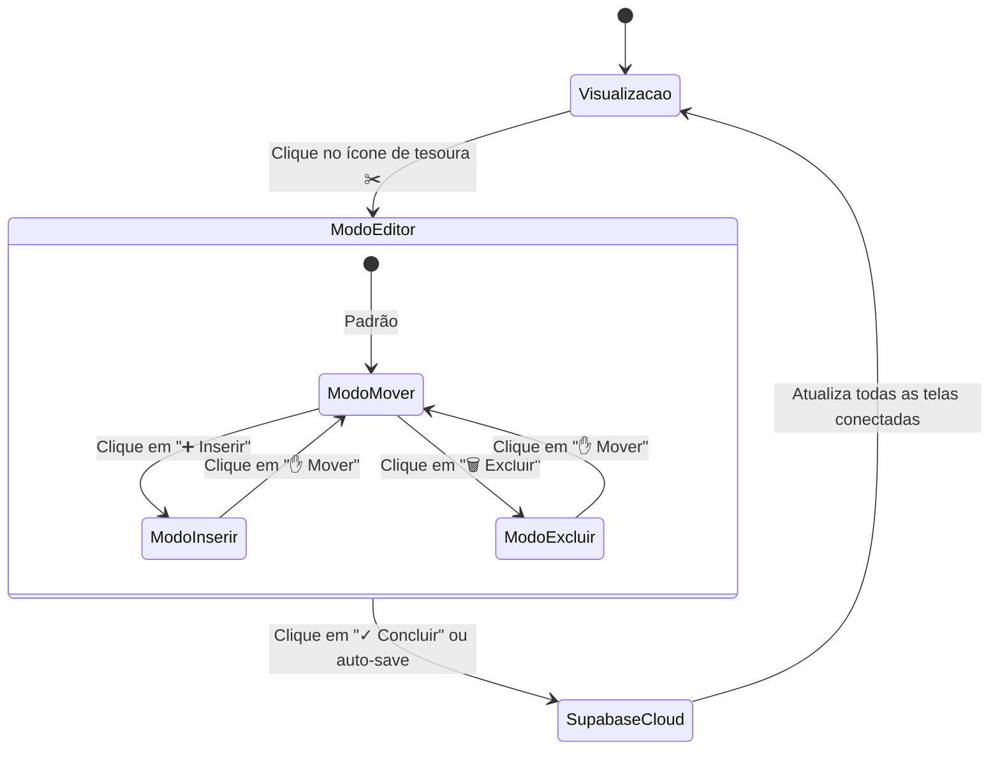

# 📐 03 - Geometria Vetorial e Divisas do MT
> Detalhamento matemático da construção vetorial do mapa brasileiro, subdivisão do Mato Grosso em 4 regiões e algoritmo do editor de nós.

---

## 🗺️ O Desafio Geométrico do Mato Grosso

O estado do Mato Grosso possui uma extensão territorial massiva e foi subdividido pela ControlSoft em **4 áreas operacionais**:
1. **Norte (Azul #0091FF):** Faixa norte do estado fazendo fronteira com o Pará.
2. **Oeste (Verde #22B14C):** Faixa oeste fazendo fronteira com Rondônia e Bolívia.
3. **Leste (Laranja #FF7F27):** Faixa leste/sul fazendo fronteira com Goiás e Tocantins.
4. **Sorriso e Região (Amarelo #FFF200):** Polo central encravado estrategicamente no coração do estado.

```
                  ┌───────────────────────────────┐
                  │           NORTE (MT)          │
                  │        (Alta Floresta)        │
                  ├───────────────┬───────────────┤
                  │               │               │
                  │   OESTE (MT)  │  LESTE (MT)   │
                  │   (Juína,     │  (Cuiabá,     │
                  │    Vilhena)   │   Rondonópl.) │
                  │               │               │
                  └───────────────┴───────────────┘
                                ▲
                        [Ponto Central]
                         (x:405, y:410)
```

---

## 🧮 A Linha Divisória Paramétrica (Nós e Splines)

As divisas não são linhas estáticas desenhadas em uma imagem. Elas são construídas como arrays de pontos de controle (`ControlPoint[]`):

```typescript
export interface ControlPoint {
  id: string;
  x: number;
  y: number;
}
```

### 1. Divisória Norte (`divNorte`)
- Composta originalmente por **24 pontos de controle** interligados por curvas suaves.
- Parte da fronteira oeste do MT (`x: 240, y: 342`), contorna a região norte de Sorriso e atinge a divisa leste com o Tocantins/Pará (`x: 550, y: 365`).

### 2. Divisória Oeste/Leste (`divOesteLeste`)
- Composta originalmente por **8 pontos de controle**.
- Conecta o ponto de encontro central (`x: 405, y: 410`) até o extremo sul da fronteira do MT (`x: 395, y: 550`).

### 3. Trava de Junção Central Automática (Magnetic Junction)
Para evitar que as regiões se desconectem e causem buracos ou sobreposições gráficas no mapa:
- O ponto inicial de `divOesteLeste[0]` é **travado matematicamente** ao nó central de `divNorte`.
- Ao mover qualquer um desses nós no editor, o algoritmo recalcula a junção em tempo real para manter a continuidade topológica do polígono.

---

## ✂️ Funcionamento do Editor Interativo de Divisas

O editor vetorial integrado permite remodelar as fronteiras diretamente no navegador:



### Modos de Operação do Editor:
1. **✋ Modo Mover:** Permite clicar e arrastar qualquer nó numerado na tela. A curva SVG é recalculada e re-renderizada a 60 FPS com aceleração de hardware.
2. **➕ Modo Inserir:** Ao passar o mouse sobre a linha divisória, o cursor identifica o segmento mais próximo e insere um novo nó paramétrico na posição exata do clique.
3. **🗑️ Modo Excluir:** Permite remover nós intermediários desnecessários sem romper a continuidade entre o início e o fim da fronteira.
4. **🔄 Reset para Padrão:** Botão de emergência que restaura as coordenadas originais (`DEFAULT_DIV_NORTE` e `DEFAULT_DIV_OESTE_LESTE`).

---

## 🗺️ Renderização dos Estados Brasileiros

Além do Mato Grosso, o mapa renderiza os demais estados da federação através de polígonos pré-computados (`brazilGeo.ts`), onde:
- **Estados Atendidos:** São preenchidos com as cores dos respectivos consultores (ex.: Pará e Roraima em Azul do Norte; Rondônia e Acre em Verde do Oeste; Goiás, Tocantins, Minas Gerais e Bahia em Laranja do Leste).
- **Estados Neutros:** São renderizados em tom escuro discreto (`#17202D`) com borda suave (`#232E3E`), mantendo o foco total nas regiões de atuação.

---

*Voltar para o [[00 - Visão Geral do Projeto|Índice Geral]]*
