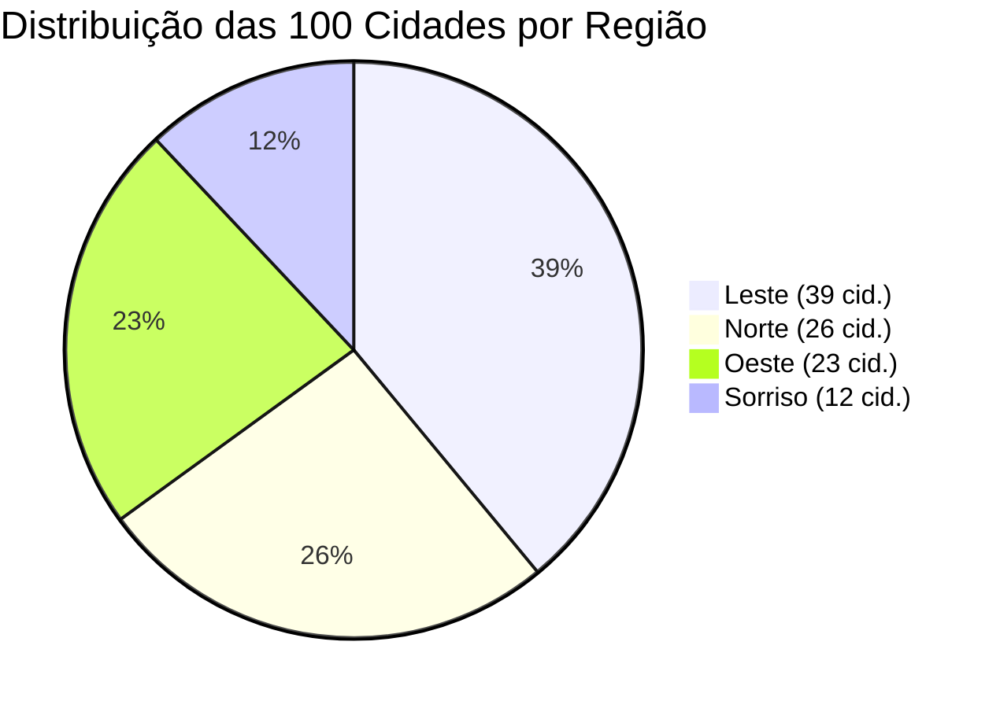

# 📊 04 - Modelagem de Dados e Cidades (100 Municípios)
> Especificação dos modelos de dados em TypeScript, distribuição por estados, equipes comerciais e base oficial de municípios.

---

## 👥 Estrutura das 4 Regiões Comerciais

A ControlSoft opera estruturada em 4 frentes de atendimento, cada uma composta por **1 Consultor**, **1 Comercial** e **Atendentes dedicados**:

| Região | Cor Tema | Polo Regional | Consultor | Comercial | Atendentes | Estados de Atuação | Total Cidades |
|---|---|---|---|---|---|---|---|
| **Norte** | `#0091FF` (Azul) | Alta Floresta | **Wanderson** | Sidnei | Jéssica e Marcos | MT, PA, RR | **26** |
| **Leste** | `#FF7F27` (Laranja) | Cuiabá | **André** | Gilberto | Gabriel e Samuel | MT, GO, TO, MG, BA | **39** |
| **Oeste** | `#22B14C` (Verde) | Vilhena | **André** | Pablo | Amanda e Cauê | MT, RO, AC | **23** |
| **Sorriso e Região** | `#FFF200` (Amarelo) | Sorriso | **Cledinei** | Sidnei | Maria e Jean | MT (Polo Central) | **12** |
| **TOTAL GERAL** | — | — | — | — | — | **9 Estados** | **100 Cidades** |

---

## 🗺️ Distribuição de Municípios por Estado e Região



### 1. Região Norte (26 Cidades)
- **Mato Grosso (15):** Alta Floresta, Bandeirantes, Carlinda, Confresa, Guarantã do Norte, Marcelândia, Matupá, Nova Canaã do Norte, Nova Guarita, Nova Monte Verde, Novo Mundo, Paranaíta, Peixoto de Azevedo, Terra Nova do Norte, Vila Rica.
- **Pará (9):** Altamira, Conceição do Araguaia, Itaituba, Moju, Novo Progresso, Redenção, Santana do Araguaia, Santa Maria das Barreiras, Santarém.
- **Roraima (2):** Boa Vista, Caracaraí.

### 2. Região Leste (39 Cidades)
- **Mato Grosso (12):** Água Boa, Bom Jesus do Araguaia, Campinápolis, Campo Verde, Canarana, Cuiabá, Nova Xavantina, Paranatinga, Primavera do Leste, Querência, Rondonópolis, Santa Rita do Trivelato.
- **Goiás (9):** Bom Jesus de Goiás, Goiatuba, Inaciolândia, Mara Rosa, Paraúna, Piranhas, Portelândia, Santa Helena de Goiás, Uruaçu.
- **Tocantins (9):** Crixás do Tocantins, Lagoa da Confusão, Marianópolis do Tocantins, Novo Acordo, Paraíso do Tocantins, Porto Nacional, Santa Maria do Tocantins, Santa Rosa do Tocantins, Silvanópolis.
- **Minas Gerais (5):** Araguari, Bom Despacho, Formiga, Guarda-Mor, Ibiá.
- **Bahia (1):** Luís Eduardo Magalhães.

### 3. Região Oeste (23 Cidades)
- **Rondônia (16):** Cabixi, Cacoal, Candeias do Jamari, Cerejeiras, Chupinguaia, Colorado do Oeste, Corumbiara, Itapuã do Oeste, Nova Mamoré, Pimenteiras do Oeste, Porto Velho, Rio Crespo, Rolim de Moura, Seringueiras, São Miguel do Guaporé, Vilhena.
- **Mato Grosso (10):** Campos de Júlio, Juara, Juína, Nova Maringá, Nova Mutum, Novo Horizonte do Norte, Porto dos Gaúchos, Rosário Oeste, Sapezal, São José do Rio Claro.
- **Acre (1):** Senador Guiomard.

### 4. Sorriso e Região (12 Cidades)
- **Mato Grosso (12):** Boa Esperança do Norte, Cláudia, Feliz Natal, Ipiranga do Norte, Itanhangá, Lucas do Rio Verde, Nova Ubiratã, Sinop, Sorriso, Tabaporã, Tapurah, Vera.

---

## 💻 Interfaces TypeScript (`src/types/region.ts`)

```typescript
export interface MembroEquipe {
  nome: string;
}

export interface Equipe {
  consultor: MembroEquipe;
  comercial: MembroEquipe;
  atendentes: MembroEquipe[];
}

export interface Regiao {
  id: 'norte' | 'leste' | 'oeste' | 'sorriso';
  nome: string;
  area: string;
  cor: string;
  tipo: 'principal' | 'sub-regiao';
  regiaoPai?: string;
  equipe: Equipe;
}

export interface ExcelCity {
  id: string;
  rawName: string;
  name: string;
  uf: string;
  lon: number;
  lat: number;
  regionId: string;
  consultor: string;
  comercial: string;
}
```

---

*Voltar para o [[00 - Visão Geral do Projeto|Índice Geral]]*
