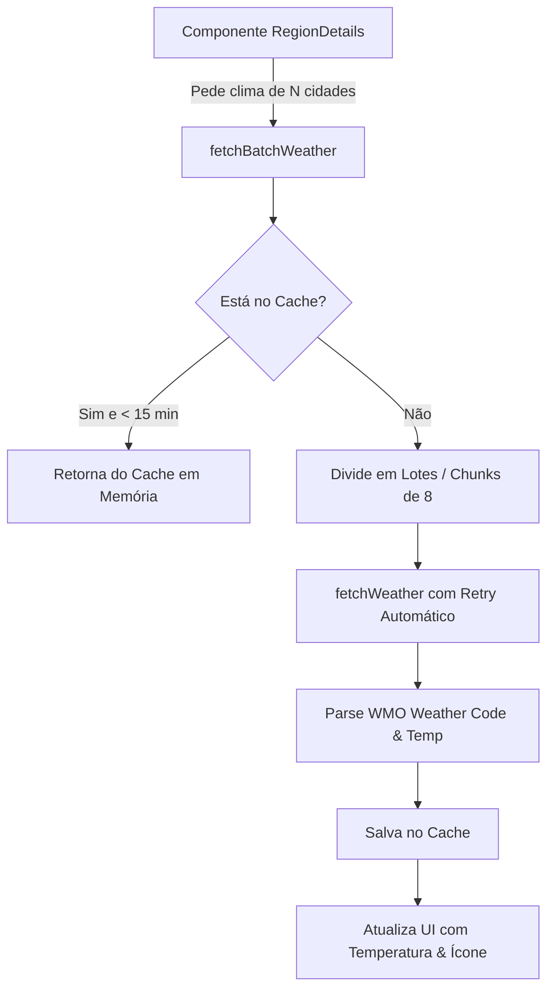

# ☀️ 05 - Módulo Meteorológico (Open-Meteo API)
> Documentação técnica da integração de previsão do tempo em tempo real para os 100 municípios e polos comerciais.

---

## 🎯 Objetivo e Importância no Agro

Para a equipe comercial e os consultores da ControlSoft que atendem produtores rurais, revendas e cooperativas, acompanhar as condições climáticas (temperatura atual, chuva e condições do céu) das cidades de destino é crucial para o planejamento de rotas, visitas e suporte ao cliente.

---

## 🌐 Provedor Utilizado: Open-Meteo REST API

A aplicação consome a API global do **Open-Meteo** (`api.open-meteo.com`):
- **Gratuita e sem necessidade de API Key** com risco de expiração ou bloqueio de faturamento.
- **Modelos Numéricos:** Combinação de modelos ECMWF, GFS e INMET com resolução de até 1km.
- **Endpoint Utilizado:**
```http
GET https://api.open-meteo.com/v1/forecast?latitude={lat}&longitude={lon}&current=temperature_2m,relative_humidity_2m,weather_code&daily=temperature_2m_max,temperature_2m_min,precipitation_probability_max&timezone=auto
```

---

## ⚙️ Arquitetura do Serviço (`src/services/weatherService.ts`)



### 1. Sistema de Cache em Memória (15 Minutos)
Para evitar chamadas redundantes a cada ciclo do Modo TV:
```typescript
const weatherCache = new Map<string, { data: WeatherData; timestamp: number }>();
const CACHE_TTL_MS = 15 * 60 * 1000; // 15 minutos
```

### 2. Chamadas em Lotes Inteligentes (Batch Chunks)
Para consultar simultaneamente as 39 cidades do Leste ou as 26 do Norte sem estourar o limite de conexões simultâneas do navegador (HTTP/2 connection pooling):
```typescript
export async function fetchBatchWeather(cities: { name: string; lat: number; lon: number }[]): Promise<Record<string, WeatherData>> {
  const results: Record<string, WeatherData> = {};
  const CHUNK_SIZE = 8;
  for (let i = 0; i < cities.length; i += CHUNK_SIZE) {
    const chunk = cities.slice(i, i + CHUNK_SIZE);
    await Promise.all(
      chunk.map(async (c) => {
        const data = await fetchWeather(c.name, c.lat, c.lon);
        if (data) results[c.name] = data;
      })
    );
  }
  return results;
}
```

### 3. Mecanismo de Retry Resiliente
Em caso de instabilidade pontual de internet ou micro-interrupções, a função faz uma segunda tentativa automática após 400ms antes de descartar a resposta.

### 4. Estratégia de Busca no `RegionMap.tsx`: Polo + Sob Demanda
Até a otimização, o `RegionMap.tsx` buscava o clima das ~100 cidades atendidas a cada 15 minutos, mesmo que a UI só exiba temperatura para no máximo 3 cidades por vez (o polo da região ativa, a cidade em hover e a cidade selecionada). Isso gerava dezenas de requisições desnecessárias por ciclo, por aba de navegador aberta.

A estratégia atual busca em três camadas independentes, todas compartilhando o mesmo cache de `weatherService.ts`:
1. **Polo (intervalo fixo):** as 4 cidades-polo (`Sorriso`, `Alta Floresta`, `Cuiabá`, `Vilhena`, de `REGION_POLO_CITIES`) são buscadas em lote no carregamento e a cada 15 minutos — cobre o badge de clima da região ativa mesmo sem interação do usuário.
2. **Hover (sob demanda):** ao passar o mouse sobre uma cidade no mapa, um `useEffect` busca o clima daquela cidade específica *apenas se ainda não estiver em cache* (checado via `weatherMapRef`, um espelho em `ref` do estado para não re-disparar o efeito a cada atualização de `weatherMap`).
3. **Cidade selecionada (sob demanda):** mesma lógica do hover, disparada quando `selectedCityObj` muda.

O `RegionDetails.tsx` mantém sua própria busca em lote, mas já era escopada corretamente (só as cidades da região atualmente selecionada, disparada apenas quando a região muda — sem polling), então não precisou de ajuste.

---

## 🌤️ Mapeamento de Códigos Meteorológicos WMO

Os códigos numéricos retornados pelo Open-Meteo são convertidos em ícones visuais e descrições em português:

| Códigos WMO | Condição do Tempo | Ícone Exibido |
|---|---|---|
| `0` | Céu Limpo / Ensolarado | ☀️ |
| `1, 2` | Parcialmente Nublado | ⛅ |
| `3` | Encoberto / Nublado | ☁️ |
| `45, 48` | Nevoeiro / Névoa | 🌫️ |
| `51, 53, 55` | Garoa / Chuvisco | 🌦️ |
| `61, 63, 65` | Chuva | 🌧️ |
| `80, 81, 82` | Pancadas de Chuva | ⛈️ |
| `95, 96, 99` | Tempestades / Trovoadas | ⚡ |

---

*Voltar para o [[00 - Visão Geral do Projeto|Índice Geral]]*
