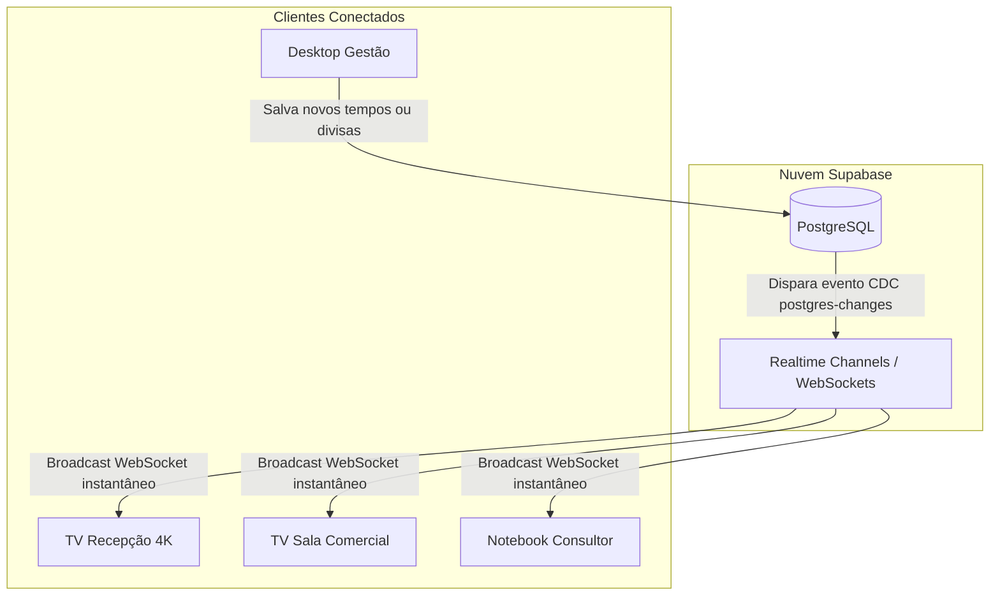

# 📺 06 - Modo TV e Sincronização em Nuvem (Supabase)
> Detalhamento da arquitetura de rotação contínua para TVs corporativas e sincronização em tempo real via PostgreSQL / Supabase Realtime.

---

## 📺 O Conceito do Modo TV Corporativa

O **Modo TV** foi criado para rodar de forma 100% autônoma em televisores e monitores de exibição contínua na sede da ControlSoft:
- Alterna ciclicamente entre:
  1. **Norte MT a PA/RR** (Duração padrão: 15s)
  2. **Leste MT a TO/GO/MG** (Duração padrão: 15s)
  3. **Oeste MT a RO/AC** (Duração padrão: 15s)
  4. **Sorriso e Região** (Duração padrão: 15s)
  5. **Visão Geral Completa** (Duração padrão: 15s)
- **Barra de Progresso:** Um indicador visual fino no topo da tela exibe a contagem regressiva suave em CSS animation.
- **Interrupção Inteligente:** Se um usuário interagir manualmente com o mapa (clicar numa região ou cidade), o Modo TV entra em pausa automática para não interromper a análise humana.

---

## ☁️ Arquitetura do Backend com Supabase



---

## 🗄️ Estrutura da Tabela no Banco de Dados (`public.mapa_config`)

A tabela utiliza o padrão chave-valor em JSONB para permitir máxima flexibilidade evolutiva:

```sql
CREATE TABLE IF NOT EXISTS public.mapa_config (
  key TEXT PRIMARY KEY,
  value JSONB NOT NULL,
  updated_at TIMESTAMPTZ DEFAULT NOW()
);

-- Habilitar Realtime
ALTER PUBLICATION supabase_realtime ADD TABLE public.mapa_config;
```

### Chaves Persistidas:
1. `map_dividers`: Contém o JSON com as coordenadas atuais de `divNorte` e `divOesteLeste`.
2. `tv_intervals`: Contém o objeto JSON com os segundos de exibição de cada slide (`norte`, `leste`, `oeste`, `sorriso`, `all`).

---

## ⚡ Implementação da Sincronização Realtime (`src/services/mapConfigService.ts`)

```typescript
export function subscribeToConfigChanges(
  onDividersChange: (dividers: SavedDividers) => void,
  onTvIntervalsChange: (intervals: TvIntervals) => void
) {
  const channelName = `mapa_config_realtime_${Date.now()}`;
  const channel = supabase
    .channel(channelName)
    .on(
      'postgres_changes',
      { event: '*', schema: 'public', table: 'mapa_config' },
      (payload) => {
        const row = payload.new as { key: string; value: any };
        if (row && row.key === 'map_dividers') {
          onDividersChange(row.value);
        } else if (row && row.key === 'tv_intervals') {
          onTvIntervalsChange(row.value);
        }
      }
    )
    .subscribe();

  return () => {
    supabase.removeChannel(channel);
  };
}
```

---

## 🔒 Políticas de Segurança (Row Level Security - RLS)

- **SELECT Público:** Qualquer TV ou visitante pode carregar as configurações do mapa sem precisar de login prévio (`FOR SELECT USING (true)`).
- **UPDATE/INSERT Público ou Protegido:** Permite atualização direta pelas estações de trabalho autorizadas (`FOR ALL USING (true) WITH CHECK (true)`).

---

*Voltar para o [[00 - Visão Geral do Projeto|Índice Geral]]*
