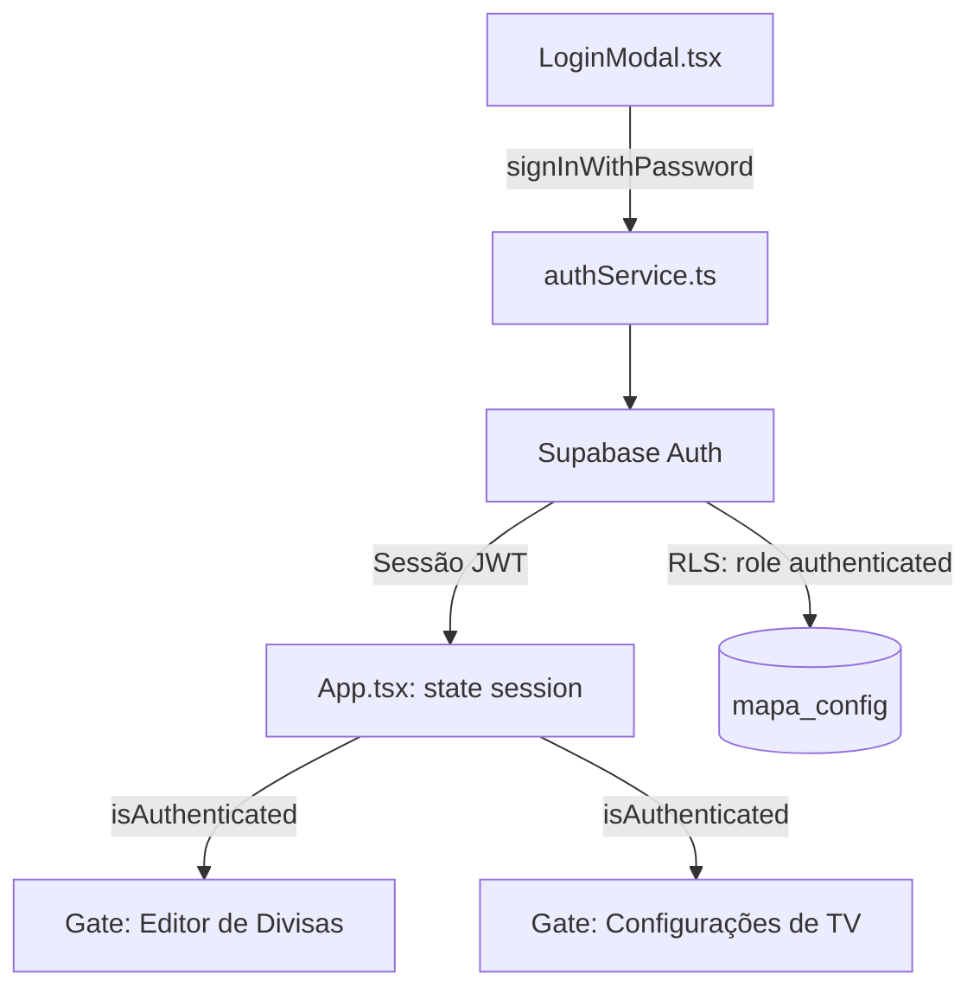

# 🔐 09 - Autenticação e Controle de Acesso
> Login restrito via Supabase Auth para edição de divisas do mapa e tempos de rotação da TV.

---

## 📌 Contexto e Motivação

Até esta implementação, a tabela `public.mapa_config` (divisas do mapa e tempos de rotação da TV) tinha política RLS de escrita totalmente pública (`FOR ALL USING (true) WITH CHECK (true)`). Como a *anon key* do Supabase é pública por design (fica embutida no bundle JS do site), qualquer visitante podia abrir o DevTools do navegador, copiar a key e alterar ou apagar as divisas/tempos de qualquer TV conectada — sem necessidade de login.

A decisão de negócio foi: **apenas duas pessoas** (o gestor do projeto e sua gestora) devem poder ajustar a região do mapa e os tempos de exibição da TV. Todos os demais usuários (TVs corporativas, consultores, visitantes do painel) devem continuar com acesso de leitura livre, sem qualquer tela de login.

---

## 🧱 Arquitetura da Solução

1. **`src/services/authService.ts`** — camada fina sobre `supabase.auth`: `signIn`, `signOut`, `getCurrentSession`, `subscribeToAuthChanges`.
2. **`src/components/UI/LoginModal.tsx`** — modal de email/senha, estilo consistente com `TvSettingsModal.tsx`.
3. **`src/App.tsx`** — mantém o estado `session` (via `getCurrentSession` + `subscribeToAuthChanges` no mount), calcula `isAuthenticated`, e usa esse flag para:
   - Interceptar `handleToggleAdjustDividers`: se `active === true` e `!isAuthenticated`, abre o `LoginModal` em vez de ativar o editor de divisas.
   - Interceptar o clique no botão "Tempos" (abre `TvSettingsModal`): só abre direto se autenticado, senão abre o `LoginModal`.
   - Exibir botão "Entrar" (não autenticado) ou "Sair" com o email da sessão (autenticado) na barra de controles do topo.
4. **Banco de dados (`supabase/auth_policies.sql`)** — a política de escrita pública foi substituída por uma restrita ao role `authenticated`. A leitura (`SELECT`) permanece pública.

---

## 🔑 Contas de Acesso

As contas são criadas manualmente pelo administrador do projeto no painel do Supabase, **não** existe tela de cadastro (signup) no app — isso é proposital, para impedir que qualquer pessoa crie a própria conta.

**Passo a passo (feito uma única vez no painel do Supabase):**
1. `Authentication > Users > Add user` — criar uma conta para o gestor do projeto e outra para a gestora, com email e senha definitivos.
2. `Authentication > Providers > Email` — desativar **"Allow new users to sign up"**, fechando a porta de autocadastro mesmo que alguém tente chamar a API diretamente.
3. Rodar o script `supabase/auth_policies.sql` no SQL Editor para trocar a política de escrita de pública para `TO authenticated`.

---

## 🖱️ Fluxo de Uso no Painel

- Usuário comum: abre o app normalmente, mapa e TV funcionam 100% sem login. Se clicar no ícone de tesoura (✂️ Ajustar Divisas) ou no botão "Tempos", vê o `LoginModal` em vez do editor.
- Usuário autorizado: clica em "Entrar", informa email/senha cadastrados no Supabase, e a sessão fica ativa (persistida pelo próprio client do Supabase) até fazer logout manual pelo botão "Sair".
- A sessão é compartilhada entre abas do mesmo navegador via `subscribeToAuthChanges`, então logar em uma aba reflete nas outras automaticamente.

---

## ⚠️ Pontos de Atenção para Evolução Futura

- Caso mais pessoas precisem editar o mapa no futuro, basta criar novas contas no painel do Supabase — não é necessário alterar código, já que a policy libera qualquer usuário do role `authenticated`.
- Se for necessário restringir ainda mais (ex: apenas 2 UIDs específicos, mesmo que outras contas existam por outro motivo), trocar `USING (true)` por `USING (auth.uid() IN ('uuid-1', 'uuid-2'))` na policy.
- Não há tela de "esqueci minha senha" implementada no app — reset de senha, se necessário, é feito direto no painel do Supabase (`Authentication > Users > ... > Send password recovery`).

---

*Voltar para o [[00 - Visão Geral do Projeto|Índice Geral]]*
